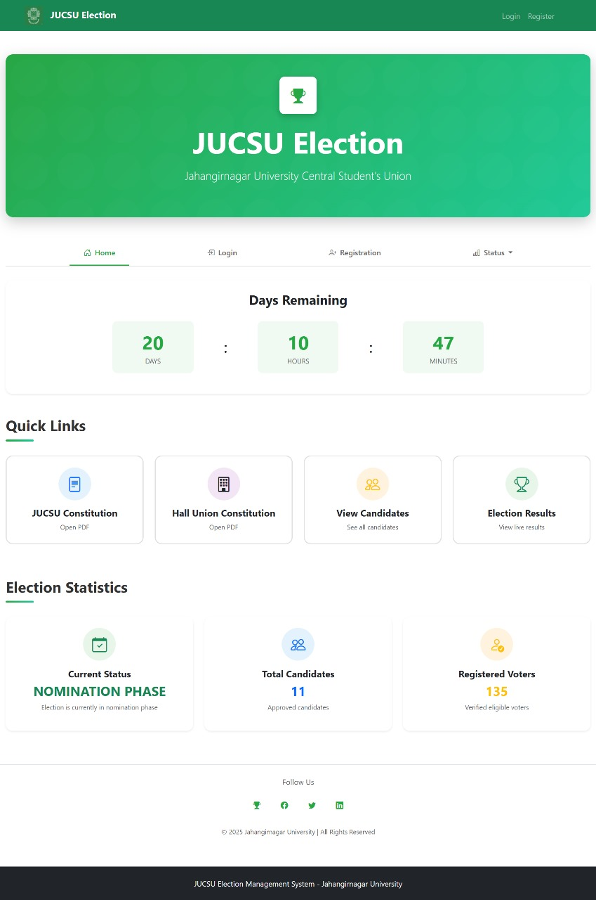
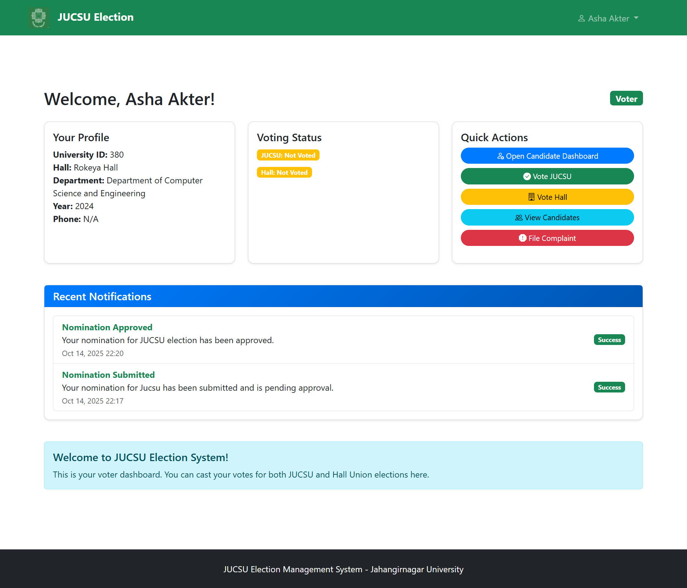
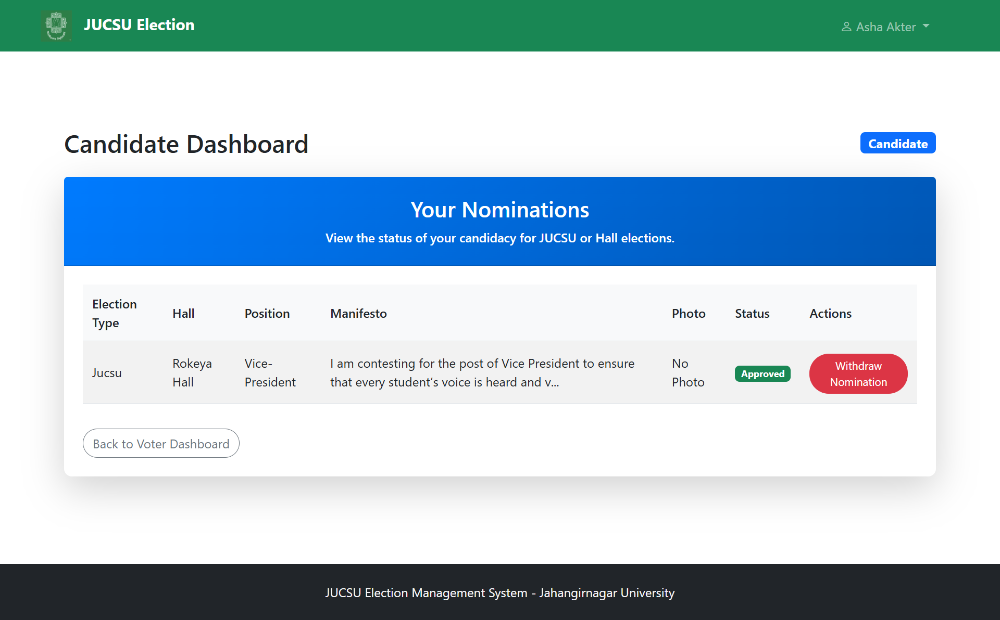
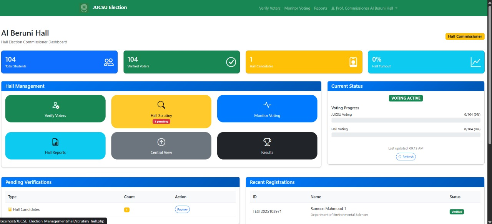
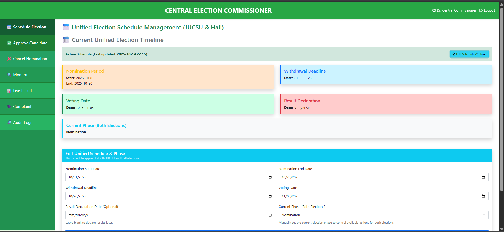
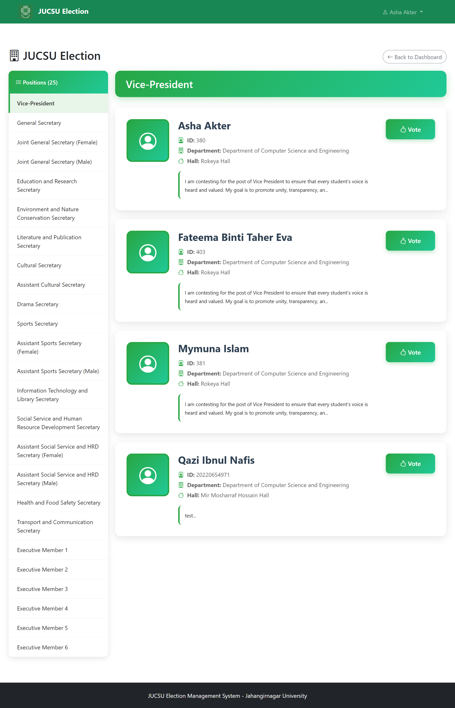
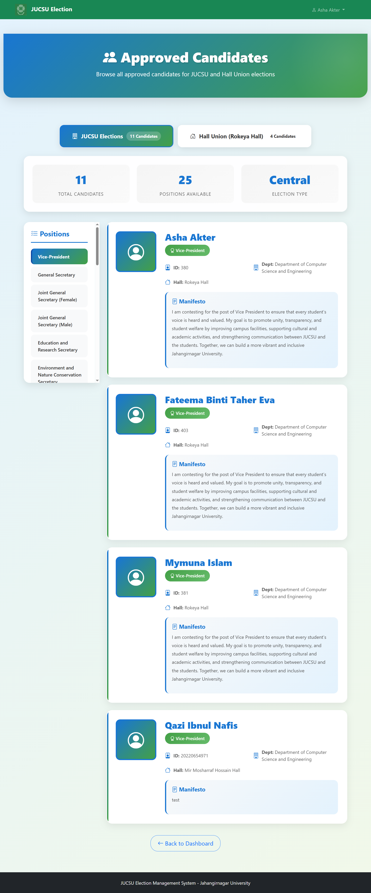
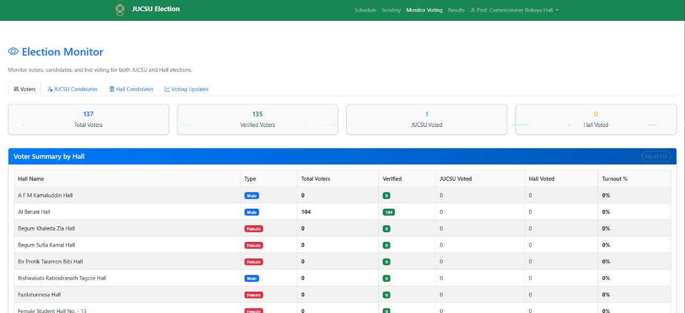

# JUCSU and Hall Union Election Management System

## Overview
The JUCSU (Jahangirnagar University Central Student's Union) and Hall Union Election Management System is a web-based application designed to manage elections for the central student union and residential hall unions at Jahangirnagar University. It streamlines voter registration, candidate nomination, voting, and result declaration while ensuring transparency, security, and scalability.

## Features
- User Management: Register and authenticate voters, commissioners, and candidates.
- Election Management: Supports both JUCSU (25 positions) and hall-specific elections (15 positions per hall).
- Secure Voting: Prevents double voting with unique constraints and tracks votes via triggers.
- Responsive UI: Built with Bootstrap for a modern, mobile-friendly interface.
- Auditability: Includes triggers for logging user and candidate status changes.
- Reporting: Provides views for candidate details, voting summaries, and hall statistics.

## Tech Stack
- Backend: PHP 7.4+ with PDO for database interactions.
- Database: MySQL 8.0+ with UTF-8 encoding.
- Frontend: Bootstrap 5 for responsive design, custom CSS for styling.
- Dependencies: No external libraries beyond Bootstrap (CDN) and PHP's PDO extension.

## Prerequisites
To set up and run the system, ensure you have:
- Web Server: Apache or Nginx.
- PHP: Version 7.4 or higher with PDO-MySQL extension.
- MySQL: Version 8.0 or higher.
- Browser: Modern browsers (Chrome, Firefox, Safari) for the frontend.
- Optional: phpMyAdmin for database management.
## Project Presentation : 
[📄 View Project Presentation PDF](https://github.com/nafiszami/JUCSU_Election_Management/blob/main/assets/pdf/JUCSU-and-Hall-Union-Election-Management-System.pdf)
## 📸 Project Screenshots  
> Below are key interfaces from the **JUCSU and Hall Union Election Management System**, showing the workflow from homepage to election monitoring.

### 🏠 Homepage

---

### 🧑‍🎓 Voter Dashboard

---

### 🗳️ Candidate Dashboard

---

### 🏢 Hall Commissioner Dashboard

---

### 🏛️ Central Commissioner Dashboard

---

### 🗳️ Voting Interface

---

### 👥 Show Candidates

---

### 📊 Election Monitor

> 🗂️ All screenshots are stored in the `assets/picture/` directory within the repository.

© 2025 Jahangirnagar University. All rights reserved.
